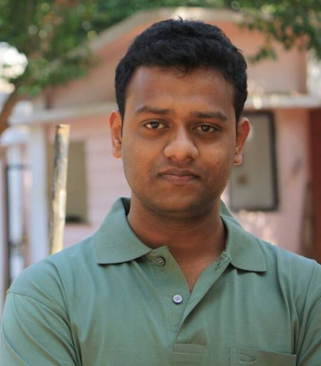

## Subodh Mishra 



Hello and welcome to my webpage. I am a Ph.D. student at [TAMU](https://www.tamu.edu/), working under the supervision of [Dr. Srikanth Saripalli](https://engineering.tamu.edu/mechanical/profiles/saripalli.html) of the [Unmanned Systems Lab](https://unmanned.tamu.edu/).  My research interests are Robot State Estimation, Perception and Sensor Calibration. 

I have a Master's degree in Control Systems Engineering from [École centrale de Nantes](https://www.ec-nantes.fr/), France. I did my [MS thesis](https://github.com/SubMishMar/SubMishMar.github.io/blob/master/thesis/Master_Internship_Report_MISHRA_Subodh%5BRevised%5D.pdf) at [CNRS-LAAS](https://www.laas.fr/public/en) under the guidance of [Dr. Antonio Franchi](https://homepages.laas.fr/afranchi/robotics/?q=node/1) on the topic of Aerial+Ground Co-Manipulation Systems.

### Markdown

Markdown is a lightweight and easy-to-use syntax for styling your writing. It includes conventions for

```markdown
Syntax highlighted code block

# Header 1
## Header 2
### Header 3

- Bulleted
- List

1. Numbered
2. List

**Bold** and _Italic_ and `Code` text

[Link](url) and 
```

For more details see [GitHub Flavored Markdown](https://guides.github.com/features/mastering-markdown/).

### Jekyll Themes

Your Pages site will use the layout and styles from the Jekyll theme you have selected in your [repository settings](https://github.com/SubMishMar/SubMishMar.github.io/settings). The name of this theme is saved in the Jekyll `_config.yml` configuration file.

### Support or Contact

Having trouble with Pages? Check out our [documentation](https://help.github.com/categories/github-pages-basics/) or [contact support](https://github.com/contact) and we’ll help you sort it out.
